# 🌱 IoT Smart Agriculture Monitoring System Pro

A Real-Time Smart Agriculture Monitoring System that combines **Live Weather Data**, **Automated Irrigation Control**, **Farm Health Analytics**, and an **Interactive Streamlit Dashboard** to simulate a modern IoT-powered farming environment.

The system integrates real-time weather information from OpenWeatherMap, continuously monitors farm conditions, automates irrigation decisions, tracks water consumption, and provides actionable insights through a professional analytics dashboard.

---
## 🌐 Live Demo

## 🔗 Live Application
https://iot-smart-agriculture-monitoring-system-gnwaufwahzeqhzndenkcmw.streamlit.app/


## 🚀 Features

### 🌤 Live Weather Monitoring

* Real-time weather data using OpenWeatherMap API
* Temperature monitoring
* Humidity tracking
* Weather condition updates
* Wind speed analysis

### 🌱 Smart Farm Monitoring

* Soil moisture tracking
* Water tank level monitoring
* Light intensity simulation
* Persistent farm state management

### 🚰 Intelligent Irrigation System

* Automated pump control
* Soil moisture based irrigation
* Water conservation logic
* Smart irrigation recommendations

### 🚨 Alert Management

* Low soil moisture alerts
* Low water tank alerts
* High temperature warnings
* Rainfall notifications

### 📊 Analytics Dashboard

* Real-time dashboard updates
* Farm health score
* Historical trend analysis
* Water consumption analytics
* Irrigation activity tracking
* Interactive gauges and charts

### 📥 Reporting

* CSV data logging
* Downloadable reports
* Historical sensor records

---

## 🏗 System Architecture

```text
                    OpenWeatherMap API
                             │
                             ▼
                    Weather Service Layer
                             │
                             ▼
                  Sensor Simulation Engine
                             │
                             ▼
                    Irrigation Controller
                             │
                             ▼
                     Alert Management
                             │
                             ▼
                        CSV Storage
                             │
                             ▼
                 Streamlit Analytics Dashboard
```

---

## 📁 Project Structure

```text
IoT-Smart-Agriculture-Monitoring-System
│
├── arduino_code/
├── circuit_diagram/
├── dashboard/
├── data/
│   ├── farm_state.json
│   └── sensor_data.csv
│
├── docs/
├── images/
│   ├── dashboard-overview.png
│   ├── weather-monitoring.png
│   ├── farm-health-score.png
│   ├── alert-center.png
│   ├── soil-moisture-gauge.png
│   ├── water-level-gauge.png
│   ├── historical-analytics.png
│   ├── sensor-data-records.png
│   ├── project-structure.png
│   ├── auto-generator-running.png
│   ├── weather-api-output.png
│   └── system-execution.png
│
├── outputs/
├── python_simulation/
├── .env.example
├── .gitignore
├── LICENSE
├── main.py
├── README.md
├── requirements.txt
└── test_weather.py
```

---

## 🛠 Technologies Used

### Backend

* Python
* Requests
* CSV Logging
* JSON State Management

### APIs

* OpenWeatherMap API

### Dashboard

* Streamlit
* Plotly

### Data Processing

* Pandas
* NumPy

---

## ⚙ Installation

### Clone Repository

```bash
git clone https://github.com/YOUR_USERNAME/IoT-Smart-Agriculture-Monitoring-System.git

cd IoT-Smart-Agriculture-Monitoring-System
```

### Create Virtual Environment

```bash
python -m venv venv
```

### Activate Environment

#### Windows

```bash
venv\Scripts\activate
```

#### Linux / Mac

```bash
source venv/bin/activate
```

### Install Dependencies

```bash
pip install -r requirements.txt
```

---

## 🔑 Environment Variables

Create a `.env` file in the project root:

```env
OPENWEATHER_API_KEY=your_openweather_api_key
CITY=Chennai

SOIL_MOISTURE_THRESHOLD=35
WATER_LEVEL_THRESHOLD=20
HIGH_TEMPERATURE_THRESHOLD=40

REFRESH_INTERVAL=60
```

---

## ▶ Running the Project

### Test Weather API

```bash
python test_weather.py
```

### Generate Farm Data

```bash
python main.py
```

### Start Auto Data Generator

```bash
python python_simulation/auto_generator.py
```

### Launch Dashboard

```bash
streamlit run python_simulation/dashboard.py
```

---

## 📸 Project Screenshots

### Dashboard Overview

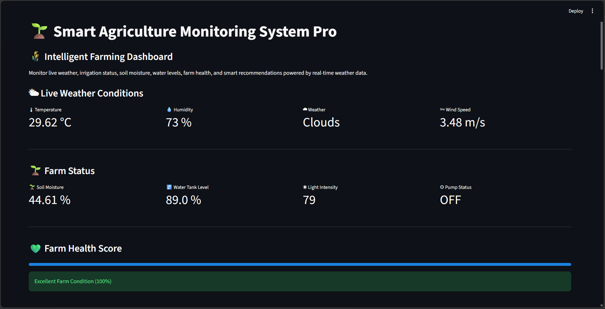

### Weather Monitoring

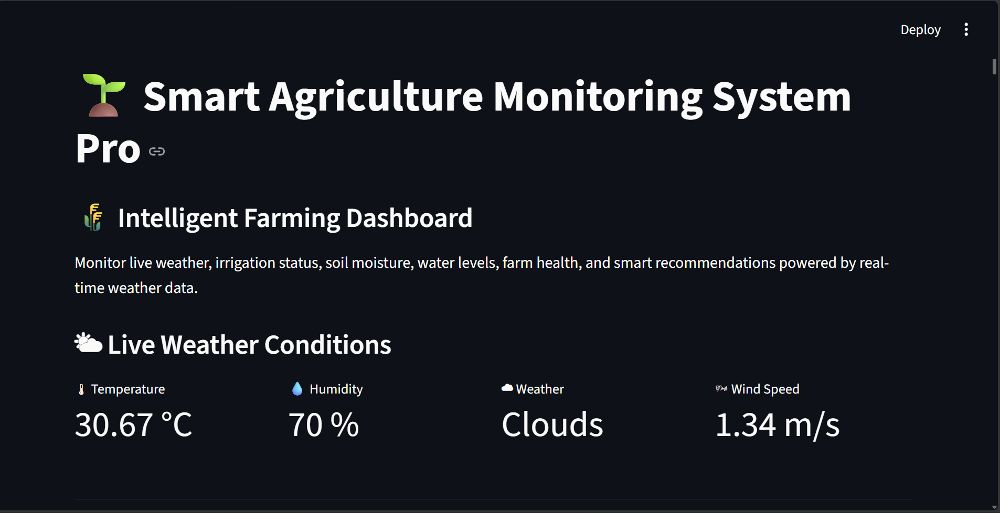

### Alert Center

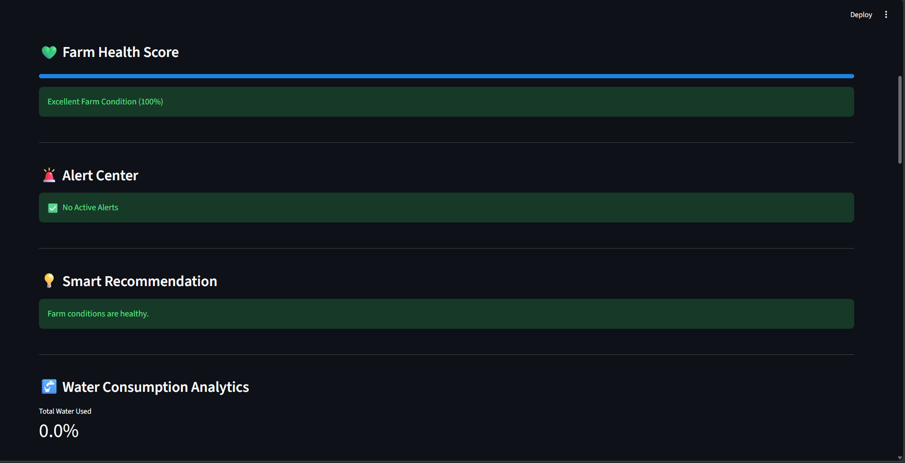

### Soil Moisture Gauge

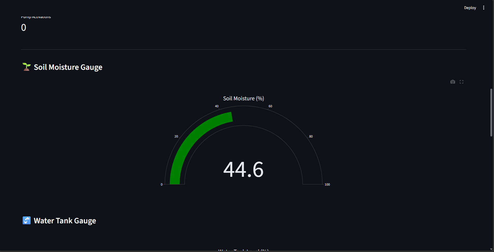

### Water Tank Gauge

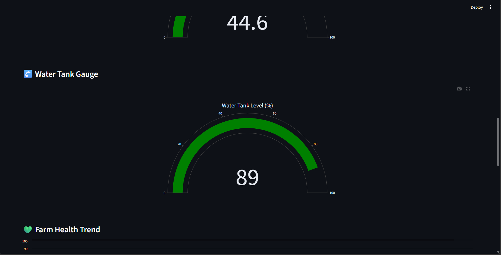

### Historical Analytics

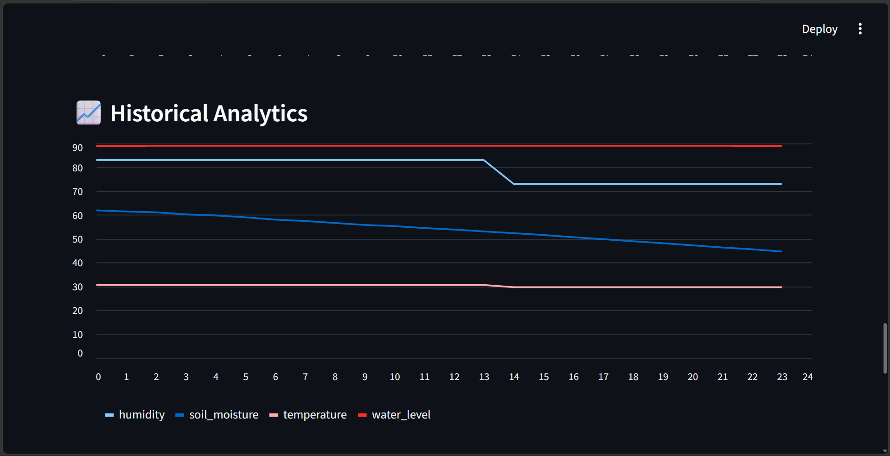

### Sensor Data Records

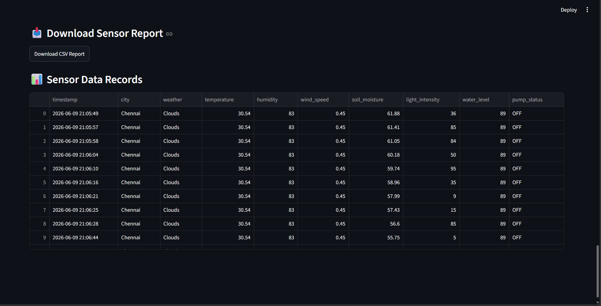

### Project Structure

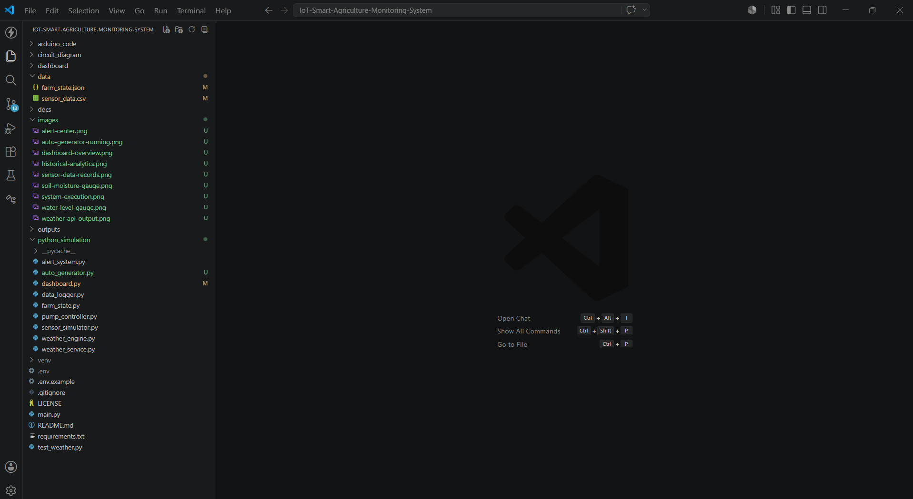

### Auto Generator Running

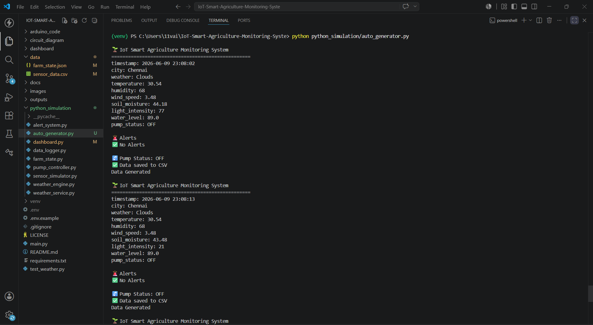

### Weather API Output

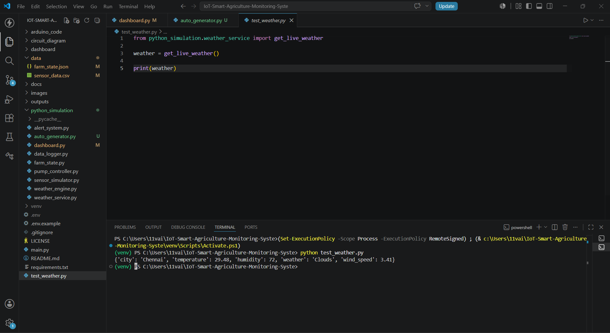

### System Execution

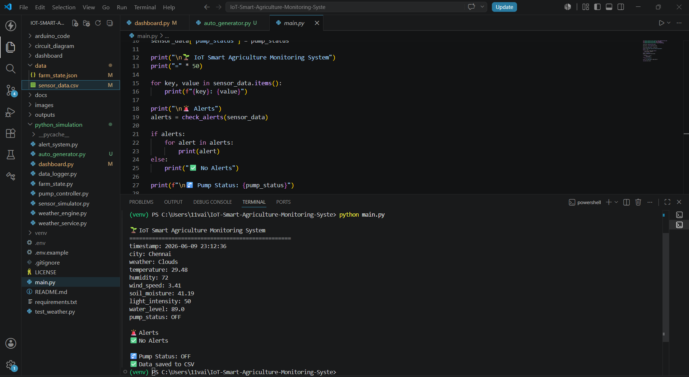

---

## 🌟 Key Highlights

* Real-Time Weather Integration
* Smart Irrigation Automation
* Persistent Farm State Tracking
* Water Consumption Analytics
* Interactive Dashboard
* Automated Data Generation
* Farm Health Monitoring
* CSV Report Generation
* IoT-Based Agriculture Simulation
* Portfolio-Ready Project

---

## 🔮 Future Enhancements

* MQTT Integration
* Real IoT Sensor Connectivity
* Machine Learning Predictions
* Crop Recommendation System
* Mobile Application
* SMS Alert Notifications
* Cloud Database Integration
* Multi-Farm Monitoring

---

## 👩‍💻 Author

**Vaishnava Devi**

---

## 📜 License

This project is licensed under the MIT License.
